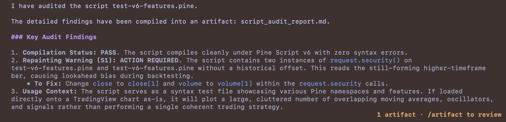

<p align="center">
  
</p>

[](https://www.claudepluginhub.com/plugins/jpantsjoha-pinescript-plugin?ref=badge)
[](https://github.com/jpantsjoha/pinescript-plugin/actions/workflows/gate.yml)
[](https://agent-plugins.org/specification)
[](https://www.npmjs.com/package/pinescript-v6-validator)
[](./LICENSE)

# pinescript-plugin

Build, run and test: see [run_instruction.md](run_instruction.md).

> **Your agent writes Pine Script it cannot check. This gives it a checker.**

> **Eight of these checks catch code that compiles perfectly and still loses money.**

Every AI Pine Script tool on the market ships advice. None of them can verify a
single line they produce. That gap is the whole reason this exists.

## The problem, precisely

Ask any coding agent for a TradingView indicator. You get code that reads
fluently and does not compile.

```pine
// Confident. Fluent. Four compile errors.
l = line.new(x1=1, y1=2, x2=3, y2=4, colour=color.red)   // it is `color`
plotshape(cond, shape=shape.triangleup)                   // it is `style=`
v = math.clamp(x, 0, 1)                                   // no such function
b = box.new(left=1, top=2, right=3, bottom=4, textalign=text.align_left)
```

Three properties of Pine make this near-certain:

1. **Parameter names are not guessable.** `label.new` takes `textalign`.
   `box.new` takes `text_halign`. Nothing about either implies the other.
2. **Several functions have two valid call forms.** `line.new`, `label.new` and
   `box.new` each accept a `chart.point` or independent coordinates. A model that
   has seen one will insist the other is wrong.
3. **The language moves quarterly, in both directions.** TradingView added
   `request.footprint()` and multiline strings, then *removed* the wrapped-line
   indentation rules in December 2025. Training data goes stale coming and going.

Sparse training data is the root cause, and TradingView say so plainly: the corpus
for Python is large enough to generate working code, and for Pine it is not.

## The expensive half nobody addresses

Compile errors cost a minute. The real damage is code that compiles and is still
wrong: a repainting signal, a `ta.*` call inside a conditional quietly corrupting
its own history, a strategy that opens positions and never closes them.

> "One overlooked mistake, like a repainting signal or scope error, can invalidate
> months of backtesting."
> — [PickMyTrade](https://blog.pickmytrade.io/debugging-tradingview-strategies-10-common-pine-script-mistakes/)

Prose cannot fix that class of bug, because the author already believes the code
is right. **Detection can.** Nine checks ship today:

| ID | Catches | Severity |
|---|---|---|
| S1 | `request.security()` reading the current, still-forming bar | Warning |
| S2 | `ta.*` inside a ternary or block, leaving gaps in its history | Warning |
| S3 | A `var` accumulator a loop re-adds to every bar and never resets | Warning |
| S5 / S6 | Over 64 plots or 40 `request.*()` calls | Error |
| S7 | `plot` / `bgcolor` / `fill` outside global scope | Error |
| S8 | A function defined inside a block | Error |
| S9 | `strategy.entry` with no exit anywhere in the script | Warning |
| S10 | A hard-coded external feed in `request.*()` without `ignore_invalid_symbol` | Info |

Considered one and decided it is fine? Silence it:

```pine
d = request.security(syminfo.tickerid, "D", close)   // pine-ignore: S1
```

Syntactic errors are never suppressible. A compile failure is a fact, not a
judgement.

## What you get

| Component | Does |
|---|---|
| `validate_pine_script` | Runs every check, returns diagnostics with line numbers |
| `lookup_pine_reference` | The real signature of any v6 built-in, overloads included |
| 4 skills | Language rules, the fix loop, indicator and strategy patterns |
| 1 hook | Validates every `.pine` file the agent edits, automatically |

## Why trust it

The engine is
[`pinescript-v6-validator`](https://www.npmjs.com/package/pinescript-v6-validator),
the same code running inside a VS Code extension with 1,400+ installs at 4.45
stars. Your agent and your editor read from one implementation, so they cannot
disagree about a file.

Behind it: 475 function signatures from the official reference, a hand-maintained
layer for everything TradingView shipped since, explicit overload modelling, and a
golden corpus proven able to fail. Reintroduce a fixed bug and the build goes red.

Every Pine example in every skill is extracted and run through that validator in
CI. A skill shipping code that fails its own checker would be worse than no skill,
so the build blocks it.

## Plugin, or VS Code extension?

Both. The distinction matters, because getting it wrong is what makes two tools
contradict each other.

```
        pinescript-v6-validator  (npm)     detection lives here, once
                     |
        +------------+------------+
        v                         v
  VS Code extension          this plugin
  surface: humans            surface: agents
  squiggles, hover           MCP, skills, hook
```

A check is written **once**, in the engine. The extension renders it as a squiggle.
This plugin returns it to the model. Neither reimplements it. The moment the same
rule exists twice they drift, and a drifted rule means your agent and your editor
disagree about the same file.

Skills are plugin-only. Prose is useless in an editor and is the whole point for
an agent. Editor affordances such as formatting and go-to-definition stay in the
extension.

## Install

One plugin, four coding assistants. Skills live in `skills/`; each harness reads
its own manifest. The validation engine comes from
[`pinescript-v6-validator`](https://www.npmjs.com/package/pinescript-v6-validator)
on npm — **no separate checkout required**.

**Claude Code**

```text
/plugin marketplace add jpantsjoha/pinescript-plugin
/plugin install pinescript-plugin@pinescript-plugin-marketplace
```

**Antigravity (Gemini)**

```bash
agy plugin install https://github.com/jpantsjoha/pinescript-plugin
```

**Codex**

```bash
codex plugin marketplace add https://github.com/jpantsjoha/pinescript-plugin
codex plugin add pinescript-plugin@pinescript-plugin-marketplace
```

Codex reads `AGENTS.md` as its always-on contract and discovers skills under
`.agents/skills/`.

**Kimi Code**

Kimi reads `.kimi-plugin/plugin.json`. Point it at the skills directly:

```bash
git clone https://github.com/jpantsjoha/pinescript-plugin
kimi --skills-dir ./pinescript-plugin/skills
```

### Verify the install

Ask your agent to validate something deliberately wrong:

```pine
//@version=6
indicator("check")
l = line.new(x1=1, y1=2, x2=3, y2=4, colour=color.red)
```

You should get **`No parameter named 'colour' in 'line.new'`**. If instead you are
told the script is fine, the MCP server is not connected — check your harness's
MCP configuration.

### Harness support

Every row below was verified by installing and running the tools, not by reading a
manifest.

| | Skills | MCP tools | Hook |
|---|:---:|:---:|:---:|
| Claude Code | ✅ | ✅ | ✅ |
| Antigravity | ✅ | ✅ | — *(harness has no hook support)* |
| Codex | ✅ | ✅ | — |
| Kimi Code | ✅ *(via `--skills-dir`)* | ✅ | — |

Antigravity auditing a script through the plugin, and finding the repainting the
author did not:



Two things are worth noticing. The model calls the plugin's own
`validatePineScript` rather than reasoning about the code from memory — the
verdict comes from the engine, not from the model's recollection of Pine. And it
does not paraphrase the warning: it names the check, states the mechanism
(reading a still-forming higher-timeframe bar), and gives the specific edit.

That is the difference between a skill that explains a diagnostic and one that
merely mentions it.

### Working on the plugin itself

```bash
git clone https://github.com/jpantsjoha/pinescript-plugin
cd pinescript-plugin && npm install && make hooks
make gate    # spec · packaging · skills · links · Pine examples · MCP tests
```

## What's in it

```
skills/pinescript-v6/          execution model, overloads, anti-repainting, limits
skills/pinescript-validation/  every diagnostic class and its deterministic fix
skills/pinescript-indicator/   validated scaffolds: overlay, oscillator, drawings
skills/pinescript-strategy/    entries, exits, sizing, and the repainting traps
mcp/server.js                  validate_pine_script + lookup_pine_reference
hooks/                         validates every .pine file the agent edits
scripts/                       spec, packaging, skill, link and example validation
tests/                         MCP behaviour tests
```

`make gate` runs everything: Agent Plugins 1.0.0 conformance, multi-client
packaging consistency, skill frontmatter contracts, reference-URL resolution,
embedded Pine validation, and the MCP behaviour tests.

## What this does not do yet

Stating it plainly beats you finding out.

- **Only constant namespaces have their member names checked.** Since engine
  0.4.x, `shape.trianglup`, `color.grene`, `plot.style_circlez` and
  `barstate.islastt` are errors. Variables in namespaces without a complete
  member list — `syminfo.*`, `timeframe.*`, `chart.*`, and non-call members of
  `ta.*` such as `ta.tr` — are not checked, so `syminfo.tickeridd` and `ta.trr`
  still validate clean. (Misspelled function *calls*, such as `ta.smaa(...)`, are
  errors.)
  `lookup_pine_reference` covers functions only, so a `found: false` for
  `barstate.islast` means "not a function", not "not real".
- **One check is specified but not built.** S4 (assignment inside `and`/`or`) is a
  heuristic about intent. Until its false-positive rate measures at zero it stays
  out. The related shape — a `ta.*` call on the right of `and`/`or`, which v6
  short-circuits into a conditional call — escapes S2 for the same reason.
- **Re-declaring a name with `=`** is a TradingView error and passes here.
- **No type inference.** A `series` value passed where `simple` is required
  compiles here and fails on TradingView. The one type rule (engine 0.4.x): a
  declared type is checked against a single direct `input.*()` call, so
  `int x = input.float(1.0)` is an error. Fixing that needs an AST the engine
  does not have.
- **Hooks work in Claude Code only.** Antigravity, Codex and Kimi get the skills
  and the MCP tools. Their harnesses do not load the hook.
- **A clean validation is not proof the script is right.** It means no known
  defect matched. Backtest assumptions, unconfirmed-bar entries and position
  sizing remain yours to check.

## Related projects

| Project | What it is |
|---|---|
| **[pinescript-vscode-extension](https://github.com/jpantsjoha/pinescript-vscode-extension)** | The VS Code extension — IntelliSense, hover docs, real-time validation. Source of the engine this plugin uses. |
| **[googlecloud-plugin](https://github.com/jpantsjoha/googlecloud-plugin)** | Same plugin architecture applied to Google Cloud delivery — solution design, security, SRE, agentic patterns. |

### Prior art

[TradersPost/pinescript-agents](https://github.com/TradersPost/pinescript-agents)
covers similar ground with seven skills and is worth a look.
[double232/pinescript-skill](https://github.com/double232/pinescript-skill) is one
deep skill with a good catalogue of hard language constraints.

The claim here is narrow and checkable. Both are prose. Neither can verify a line
of the Pine it produces. This ships the checker.

## Contributing

Found Pine that this validator gets wrong? That is the most valuable bug report
available. A false positive is worse than a missed error, because it puts red
marks on correct code and teaches people to ignore the tool. Open an issue with
the smallest script that reproduces it.

## Author

**Jaroslav Pantsjoha**

- Website: [jpantsjoha.com](https://jpantsjoha.com)
- GitHub: [@jpantsjoha](https://github.com/jpantsjoha)
- LinkedIn: [in/johas](https://uk.linkedin.com/in/johas)

## License

MIT
